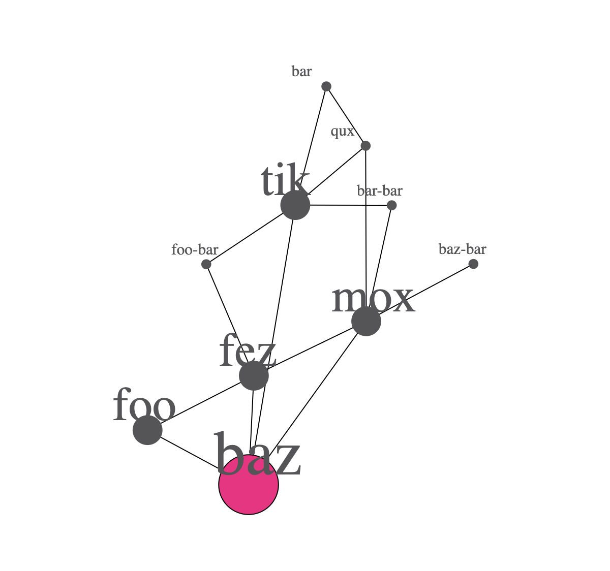

# Link Graph

A D3.js-based link graph visualization library built with TypeScript.



## Features

- Interactive graph visualization using D3.js
- TypeScript support for type safety
- Configurable layout and styling
- Hot reload development environment
- Collision detection for node positioning

## Installation

```bash
npm install @adaptivekind/knowledge-graph
```

## Quick Start

```typescript
import * as linkGraph from "@adaptivekind/linkGraph";
import * as d3 from "d3";

// Create sample data
const data = knowledgeGraph
  .builder()
  .many(4, {
    linkCount: 5,
    linkCluster: 3,
  })
  .build();

// Set up SVG
const svg = d3.select("#my-graph");
svg.attr("viewBox", "0 0 800 600");

// Render the graph
knowledgeGraph.render(
  "root-node",
  data,
  knowledgeGraph.defaultConfiguration({
    viewWidth: 800,
    viewHeight: 600,
  }),
  svg,
);
```

## Development

### Setup

```bash
npm install
```

### Development Server

Start the development server with hot reload:

```bash
npm start
```

This will open http://localhost:3000 with a live preview of the graph.

### Building

```bash
npm run build          # Production build
npm run build:watch    # Watch mode
```

### Testing

```bash
npm test              # Run tests
npm run test:watch    # Watch mode
```

### Linting

```bash
npm run lint          # Check code style
npm run lint:fix      # Fix issues
```

## License

MIT
